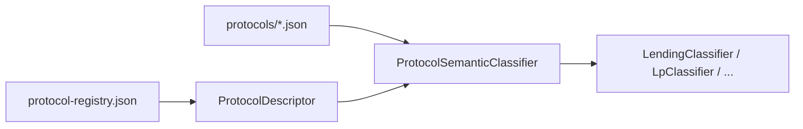

# Protocol descriptor

> **Status:** Design contract (A5). Value types land in `canonical`; registry wiring in `application.normalization`.

A **protocol descriptor** is the stable, machine-readable identity of an on-chain protocol independent of any single contract address or network deployment.

## Goals

- Single discovery key for normalization, linking, and documentation
- Decouple **registry JSON** from **semantic classifier** and **family handoff**
- Enable `ProtocolDescriptor` registry (A5) without duplicating strings across classifiers

## Descriptor fields (planned)

| Field | Type | Meaning |
|-------|------|---------|
| `protocolKey` | `String` | Stable slug, e.g. `morpho`, `pendle` |
| `displayName` | `String` | Human label |
| `families` | `Set<ProtocolFamily>` | Primary accounting families (LENDING, LP, BRIDGE, …) |
| `resourcePath` | `Optional<String>` | Classpath JSON, e.g. `protocols/morpho.json` |
| `semanticClassifier` | `Optional<Class<?>>` | `ProtocolSemanticClassifier` bean |
| `capabilityTags` | `Set<String>` | SPI tags — see [capability-behavior-spi](capability-behavior-spi.md) |
| `networks` | `Set<NetworkId>` | Deployments known to registry (may be `*` for omnichain) |

## Relationship to existing artifacts

| Artifact | Today | Target |
|----------|-------|--------|
| `protocol-registry.json` | Address → protocol name/version | Feeds descriptor deployments |
| `backend/src/main/resources/protocols/*.json` | Selector hints, grammar | Linked by `resourcePath` |
| `ProtocolSemanticClassifier` | Spring beans per protocol | Referenced from descriptor |
| Normalization rule doc | Human contract | Linked by `protocolKey` |

## Invariants

1. **`protocolKey` is immutable** once ledger rows exist — renames require ADR + backfill plan.
2. **One semantic classifier per `protocolKey`** on the hot path; families consume hints, not duplicate protocol logic.
3. **Descriptor is read-only at runtime** — loaded at startup from registry + classpath catalog.
4. **No accounting in descriptor** — AVCO semantics stay in replay handlers and family rules.

## Examples

| protocolKey | families | resourcePath | semanticClassifier |
|-------------|----------|--------------|-------------------|
| `morpho` | LENDING, YIELD | `protocols/morpho.json` | `MorphoProtocolSemanticClassifier` |
| `pendle` | LP | `protocols/pendle.json` | `PendleProtocolSemanticClassifier` |

Rule docs: [Morpho](../pipeline/normalization/rules/protocols/morpho.md), [Pendle](../pipeline/normalization/rules/protocols/pendle.md).

## Related

- [Capability / behavior SPI](capability-behavior-spi.md)
- [Add a protocol](extensibility/add-a-protocol.md)
- [Normalization rules index](../pipeline/normalization/rules/README.md)
- [ADR-001 strangler refactor](../adr/ADR-001-onchain-classification-strangler-refactor.md)
