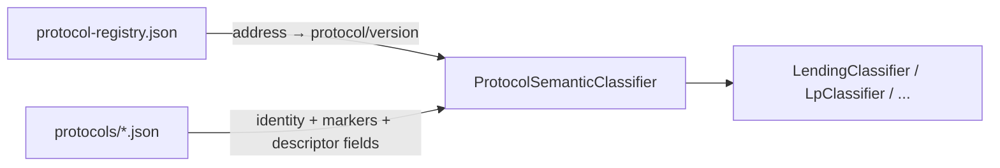

# Protocol descriptor

> **Status:** Design contract (A5). The standalone `protocol-descriptors/*.json` plane
> and the descriptor behavior SPI (`descriptor/spi/*`) were **retired on 2026-07-16**
> (they had no runtime consumer and duplicated `protocols/*.json`). The descriptor
> **identity fields now live inside `protocols/*.json`** as optional sub-objects
> (`semanticClassifier`, `lpPresentation`, `lending`, `valuationSource`), parsed into
> `ProtocolResourceDefinition`. This page remains the target contract for the descriptor
> concept; the sections below describe how that intent is expressed today.
> See the [protocol config consolidation assessment](../tasks/protocol-config-consolidation-assessment.md#5-outcome-implemented).

A **protocol descriptor** is the stable, machine-readable identity of an on-chain protocol independent of any single contract address or network deployment. Today this identity is carried by a `protocols/*.json` profile (keyed by `protocol[:version]`) rather than a separate descriptor file.

## Goals

- Single discovery key for normalization, linking, and documentation
- Decouple **registry JSON** from **semantic classifier** and **family handoff**
- Enable `ProtocolDescriptor` registry (A5) without duplicating strings across classifiers

## Descriptor fields (in `protocols/*.json`)

The identity/behavior metadata lives on the `protocols/*.json` profile, mapped to
`ProtocolResourceDefinition`. Descriptor-grade fields are optional:

| Field | Type | Meaning |
|-------|------|---------|
| `key` / `protocol` / `version` | `String` | Stable slug + display protocol + optional version |
| `families` | `List<String>` | Primary accounting families (LENDING, LP, BRIDGE, …) |
| `aliases` | `List<String>` | Alternate protocol names |
| `capabilities` | `List<String>` | Free-string capability flags (`LP_POSITION_NFT`, `BORROW_REPAY`, …) — single vocabulary |
| `markers` | object | Selector/event/asset grammar consumed by the semantic classifier |
| `semanticClassifier` | `String?` | Slug of the `ProtocolSemanticClassifier` bean (e.g. `aave-v3`) — optional |
| `lpPresentation` | object? | `positionIdentityStrategy`, `receiptTokenPatterns` — optional |
| `lending` | object? | `marketRateSource`, `supportsVariableDebt` — optional |
| `valuationSource` | object? | `primarySource`, `fallbackSources` — optional |

> The last four fields are folded-in descriptor metadata (2026-07-16). They are parsed
> and available on the catalog but **not yet wired to a consumer** — no behavior depends
> on them. Deployments/networks come from `protocol-registry.json`, keyed by address.

## Relationship to existing artifacts

| Artifact | Role today |
|----------|------------|
| `protocol-registry.json` | Address → protocol name/version/family/role/event_type (hot, address-keyed) |
| `backend/core/src/main/resources/protocols/*.json` | Protocol identity, selector/event grammar, folded descriptor fields (protocol-keyed) |
| `ProtocolSemanticClassifier` | Spring beans per protocol; consume the `protocols/*.json` profile |
| Normalization rule doc | Human contract, linked by `key` |

## Invariants

1. **`protocolKey` is immutable** once ledger rows exist — renames require ADR + backfill plan.
2. **One semantic classifier per `protocolKey`** on the hot path; families consume hints, not duplicate protocol logic.
3. **Descriptor is read-only at runtime** — loaded at startup from registry + classpath catalog.
4. **No accounting in descriptor** — AVCO semantics stay in replay handlers and family rules.

## Examples

| protocol profile | families | file | folded descriptor fields |
|------------------|----------|------|--------------------------|
| `aave` | LENDING | `protocols/aave.json` | `semanticClassifier`, `lending`, `valuationSource` |
| `gmx-v2` | LP | `protocols/gmx-v2.json` | `semanticClassifier`, `lpPresentation`, `valuationSource` |
| `uniswap` | LP | `protocols/uniswap.json` | `semanticClassifier`, `lpPresentation` |
| `morpho` | LENDING, YIELD | `protocols/morpho.json` | (identity + markers only) |

Rule docs: [Aave](../pipeline/normalization/rules/protocols/aave.md), [GMX v2](../pipeline/normalization/rules/protocols/gmx-v2.md), [Uniswap](../pipeline/normalization/rules/protocols/uniswap.md).

## Related

- [Capability / behavior SPI](capability-behavior-spi.md)
- [Add a protocol](extensibility/add-a-protocol.md)
- [Normalization rules index](../pipeline/normalization/rules/README.md)
- [ADR-001 strangler refactor](../adr/ADR-001-onchain-classification-strangler-refactor.md)
