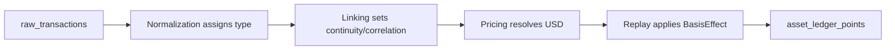

# Transaction Types Reference

> **Last updated:** 2026-07-16

Authoritative enum: `NormalizedTransactionType.java` (52 values).

Cross-stage index. Per-stage detail also in each `pipeline/<stage>/` doc.

## How a type flows through stages

Each column in the matrix below answers "what happens to this type at that stage".

## Type × stage matrix (summary)

| Type | Family | Normalization | Linking | Pricing | Replay | Ledger |
|------|--------|---------------|---------|---------|--------|--------|
| `SWAP` | Swap | SwapClassifier / SwapSemantic / registry | Single-tx; no continuity | All non-FEE legs priceabl | GenericFlowReplayEngine B | ACQUIRE/DISPOSE SPOT |
| `STAKING_DEPOSIT` | Staking | StakingClassifier | Custody continuity if correlat | Deposit leg priced | Custody handler or generi | CARRY_OUT/CARRY_IN o |
| `STAKING_WITHDRAW_REQUEST` | Staking | StakingClassifier | Async lifecycle chain | Request leg often PRICING | Async lifecycle handler | REQUEST STAKING |
| `STAKING_WITHDRAW` | Staking | StakingClassifier | Settlement of request | Settlement leg priced | Async lifecycle / DISPOSE | SETTLEMENT STAKING D |
| `LP_ENTRY_REQUEST` | LP | GmxLp / semantic LP | GMX async correlation | Request PRICING_SKIPPED | GenericAsyncLifecycleRepl | REQUEST LP |
| `LP_ENTRY_SETTLEMENT` | LP | GmxLp / LpSemantic | correlationId market | Settlement legs priced | GmxLpEntryReplayHandler / | SETTLEMENT LP ACQUIR |
| `LP_EXIT_REQUEST` | LP | GmxLp / semantic | Async chain | Request skipped | Async lifecycle | REQUEST LP |
| `LP_EXIT_SETTLEMENT` | LP | GmxLp / LpSemantic | correlationId | All return legs priced | PositionScopedLpExitRepla | SETTLEMENT LP DISPOS |
| `LP_ENTRY` | LP | LpClassifier / LpRegistry | LP receipt marker; position co | All deposit legs | LpReceiptEntryReplayHandl | ACQUIRE/CARRY_IN LP |
| `LP_EXIT` | LP | LpRegistry / LpSemantic | Position-scoped bucket | Per-asset attribution ADR | PositionScopedLpExitRepla | DISPOSE/CARRY_OUT LP |
| `LP_EXIT_PARTIAL` | LP | LpSemantic | Partial principal return | Priced legs | PositionScopedLpExit | DISPOSE LP |
| `LP_EXIT_FINAL` | LP | LpSemantic | Final close | Priced | PositionScopedLpExit clea | DISPOSE LP |
| `LP_ADJUST` | LP | LpSemantic | Same position | Adjust legs | Generic LP | REALLOCATE or CARRY  |
| `LP_POSITION_STAKE` | LP | LpPositionLifecycleSupport | MasterChef stake continuity | Stake leg | TransferReplayHandler cus | CARRY_OUT LP |
| `LP_POSITION_UNSTAKE` | LP | LpPositionLifecycleSupport | Unstake continuity | Unstake leg | TransferReplayHandler | CARRY_IN LP |
| `LP_FEE_CLAIM` | LP | LpFeeClaimClassifier | Not principal close | Reward legs priced | REWARD / fee income | ACQUIRE REWARD |
| `LENDING_DEPOSIT` | Lending | LendingClassifier / Aave shape | Custody continuity | Deposit leg | TransferReplayHandler or  | CARRY_OUT/CARRY_IN L |
| `LENDING_LOOP_OPEN` | Lending | LendingClassifier | Loop chain 24h collapse in UI | All legs | Generic + loop metadata | LOOP OPEN |
| `LENDING_LOOP_REBALANCE` | Lending | LendingClassifier | Same cycle | Legs priced | Generic | LOOP |
| `LENDING_LOOP_DECREASE` | Lending | LendingClassifier | Partial loop close | Legs priced | Generic DISPOSE partial | LOOP DECREASE |
| `LENDING_LOOP_CLOSE` | Lending | LendingClassifier | Cycle close | Legs priced | Generic close | LOOP CLOSE |
| `LENDING_WITHDRAW` | Lending | LendingClassifier | Custody return | Withdraw leg | CARRY_IN or DISPOSE | CARRY_IN LENDING |
| `EARN_FLEXIBLE_SAVING` | Bybit | Bybit normalization | Bybit internal continuity | Priced | BybitVenueInternal or tra | CARRY/ACQUIRE |
| `BORROW` | Lending | LendingClassifier | Borrow liability tracker | Market price inflow ADR-0 | BorrowReplayHandler | ACQUIRE LENDING + li |
| `REPAY` | Lending | LendingClassifier | Matches liability | Repay leg | RepayReplayHandler | DISPOSE LENDING |
| `VAULT_DEPOSIT` | Vault | VaultClassifier / Fluid | Custody continuity | Deposit leg | TransferReplayHandler | CARRY_OUT VAULT |
| `VAULT_WITHDRAW` | Vault | VaultClassifier | Custody return | Withdraw leg | CARRY_IN VAULT | CARRY_IN VAULT |
| `BRIDGE_OUT` | Bridge | BridgeStartClassifier | continuityCandidate; pair BRID | Outbound leg; orphan fall | TransferReplayHandler CAR | CARRY_OUT BRIDGE SOU |
| `BRIDGE_IN` | Bridge | BridgeSettlementClassifier / linking | continuityCandidate after repa | Inbound; market if orphan | CARRY_IN not ACQUIRE if l | CARRY_IN BRIDGE DEST |
| `DEX_ORDER_REQUEST` | Trading | TradingClassifier / CoW | Async order chain | Request skipped | AsyncSpotOrderReplayHandl | REQUEST ORDER |
| `DEX_ORDER_SETTLEMENT` | Trading | CoW semantic | Settlement | All legs | AsyncSpotOrder | SETTLEMENT ORDER |
| `DERIVATIVE_ORDER_REQUEST` | Trading | GmxProtocolSemantic | GMX correlation | Request skipped | GenericAsyncLifecycle | REQUEST DERIVATIVE |
| `DERIVATIVE_ORDER_EXECUTION` | Trading | TradingClassifier | Execution | Legs priced | Generic | SETTLEMENT DERIVATIV |
| `DERIVATIVE_ORDER_CANCEL` | Trading | TradingClassifier | Cancel refund | Refund legs | Generic | ACQUIRE/DISPOSE DERI |
| `DERIVATIVE_POSITION_INCREASE` | Trading | GmxProtocolSemantic | Position correlation | Legs priced | Generic | DERIVATIVE |
| `DERIVATIVE_POSITION_DECREASE` | Trading | GmxProtocolSemantic | Decrease | Legs priced | Generic DISPOSE | DERIVATIVE DISPOSE |
| `CEX_DERIVATIVE_SETTLEMENT` | Trading | Dzengi trading position history | No continuity | Settlement legs priced | Generic derivative | DERIVATIVE |
| `PROTOCOL_CUSTODY_DEPOSIT` | Custody | Registry CUSTODY | continuityCandidate | Deposit leg | TransferReplayHandler | CARRY_OUT CUSTODY |
| `PROTOCOL_CUSTODY_WITHDRAW` | Custody | Registry CUSTODY | continuity | Withdraw leg | CARRY_IN CUSTODY | CARRY_IN CUSTODY |
| `REWARD_CLAIM` | Reward | TransferClassifier / rewards | May attach lending cycle | Reward leg priced | ACQUIRE REWARD | ACQUIRE REWARD |
| `EXTERNAL_TRANSFER_OUT` | Transfer | TransferClassifier | External counterparty pool | Outbound if not continuit | DISPOSE or CARRY_OUT | DISPOSE/CARRY_OUT TR |
| `EXTERNAL_TRANSFER_IN` | Transfer | TransferClassifier | Orphan bridge fallback | Inbound market if unmatch | ACQUIRE or CARRY_IN | ACQUIRE/CARRY_IN TRA |
| `SPONSORED_GAS_IN` | Transfer | SponsoredGasTopUpSupport | Gas only | PRICING_SKIPPED qty | GAS_ONLY | GAS_ONLY |
| `INTERNAL_TRANSFER` | Transfer | Internal pairer / linking | continuityCandidate wallet↔wal | Transfer legs | TransferReplayHandler | CARRY_OUT/CARRY_IN T |
| `APPROVE` | Non-economic | NonEconomic / admin | Excluded or non-economic | Not priceable | Skipped | — |
| `FEE` | Fee | Standalone fee rows | — | Fee leg USD | applyFee AVCO relief | DISPOSE/GAS_ONLY |
| `ADMIN_CONFIG` | Non-economic | AdminConfigClassifier | — | PRICING_SKIPPED | Excluded | — |
| `WRAP` | Wrap | WrappedNativeClassifier | Same-family continuity | Native/wrapped parity | Wrap handler REALLOCATE | WRAP |
| `UNWRAP` | Wrap | WrappedNativeClassifier | Continuity | Parity | Unwrap REALLOCATE | UNWRAP |
| `NFT_MINT` | Default | Heuristic / NFT | — | Mint leg | Generic ACQUIRE | ACQUIRE |
| `UNKNOWN` | Default | DefaultClassifier terminal | — | May block stat | Skipped or UNKNOWN effect | UNKNOWN |
| `MANUAL_COMPENSATING` | Manual | Manual API only (not classifier) | — | User-supplied price | Manual handler | ACQUIRE/DISPOSE MANUAL |

---

## Per-type detail

### SWAP {#swap}

**Family:** Swap

#### Meaning / when produced
Canonical type `SWAP` assigned during on-chain or Bybit normalization.

#### Normalization rules
SwapClassifier / SwapSemantic / registry. See [normalization rules](../pipeline/normalization/rules/README.md).

#### Linking
Single-tx; no continuity. See [linking](../pipeline/linking/02-rules-and-repairs.md).

#### Pricing
All non-FEE legs priceable; SWAP_DERIVED if single canonical asset. See [pricing resolver chain](../pipeline/pricing/02-resolver-chain.md).

#### Replay / AVCO
GenericFlowReplayEngine BUY/SELL. See [replay handlers](../pipeline/replay/02-handlers.md).

#### Ledger output
Typical `BasisEffect` + `LifecycleKind`: ACQUIRE/DISPOSE SPOT. See [ledger points](ledger-points-and-basis-effects.md).

### STAKING_DEPOSIT {#staking-deposit}

**Family:** Staking

#### Meaning / when produced
Canonical type `STAKING_DEPOSIT` assigned during on-chain or Bybit normalization.

#### Normalization rules
StakingClassifier. See [normalization rules](../pipeline/normalization/rules/README.md).

#### Linking
Custody continuity if correlated. See [linking](../pipeline/linking/02-rules-and-repairs.md).

#### Pricing
Deposit leg priced. See [pricing resolver chain](../pipeline/pricing/02-resolver-chain.md).

#### Replay / AVCO
Custody handler or generic BUY. See [replay handlers](../pipeline/replay/02-handlers.md).

#### Ledger output
Typical `BasisEffect` + `LifecycleKind`: CARRY_OUT/CARRY_IN or ACQUIRE CUSTODY. See [ledger points](ledger-points-and-basis-effects.md).

### STAKING_WITHDRAW_REQUEST {#staking-withdraw-request}

**Family:** Staking

#### Meaning / when produced
Canonical type `STAKING_WITHDRAW_REQUEST` assigned during on-chain or Bybit normalization.

#### Normalization rules
StakingClassifier. See [normalization rules](../pipeline/normalization/rules/README.md).

#### Linking
Async lifecycle chain. See [linking](../pipeline/linking/02-rules-and-repairs.md).

#### Pricing
Request leg often PRICING_SKIPPED. See [pricing resolver chain](../pipeline/pricing/02-resolver-chain.md).

#### Replay / AVCO
Async lifecycle handler. See [replay handlers](../pipeline/replay/02-handlers.md).

#### Ledger output
Typical `BasisEffect` + `LifecycleKind`: REQUEST STAKING. See [ledger points](ledger-points-and-basis-effects.md).

### STAKING_WITHDRAW {#staking-withdraw}

**Family:** Staking

#### Meaning / when produced
Canonical type `STAKING_WITHDRAW` assigned during on-chain or Bybit normalization.

#### Normalization rules
StakingClassifier. See [normalization rules](../pipeline/normalization/rules/README.md).

#### Linking
Settlement of request. See [linking](../pipeline/linking/02-rules-and-repairs.md).

#### Pricing
Settlement leg priced. See [pricing resolver chain](../pipeline/pricing/02-resolver-chain.md).

#### Replay / AVCO
Async lifecycle / DISPOSE. See [replay handlers](../pipeline/replay/02-handlers.md).

#### Ledger output
Typical `BasisEffect` + `LifecycleKind`: SETTLEMENT STAKING DISPOSE. See [ledger points](ledger-points-and-basis-effects.md).

### LP_ENTRY_REQUEST {#lp-entry-request}

**Family:** LP

#### Meaning / when produced
Canonical type `LP_ENTRY_REQUEST` assigned during on-chain or Bybit normalization.

#### Normalization rules
GmxLp / semantic LP. See [normalization rules](../pipeline/normalization/rules/README.md).

#### Linking
GMX async correlation. See [linking](../pipeline/linking/02-rules-and-repairs.md).

#### Pricing
Request PRICING_SKIPPED. See [pricing resolver chain](../pipeline/pricing/02-resolver-chain.md).

#### Replay / AVCO
GenericAsyncLifecycleReplayHandler. See [replay handlers](../pipeline/replay/02-handlers.md).

#### Ledger output
Typical `BasisEffect` + `LifecycleKind`: REQUEST LP. See [ledger points](ledger-points-and-basis-effects.md).

### LP_ENTRY_SETTLEMENT {#lp-entry-settlement}

**Family:** LP

#### Meaning / when produced
Canonical type `LP_ENTRY_SETTLEMENT` assigned during on-chain or Bybit normalization.

#### Normalization rules
GmxLp / LpSemantic. See [normalization rules](../pipeline/normalization/rules/README.md).

#### Linking
correlationId market. See [linking](../pipeline/linking/02-rules-and-repairs.md).

#### Pricing
Settlement legs priced. See [pricing resolver chain](../pipeline/pricing/02-resolver-chain.md).

#### Replay / AVCO
GmxLpEntryReplayHandler / LpReceiptEntry. See [replay handlers](../pipeline/replay/02-handlers.md).

#### Ledger output
Typical `BasisEffect` + `LifecycleKind`: SETTLEMENT LP ACQUIRE/CARRY. See [ledger points](ledger-points-and-basis-effects.md).

### LP_EXIT_REQUEST {#lp-exit-request}

**Family:** LP

#### Meaning / when produced
Canonical type `LP_EXIT_REQUEST` assigned during on-chain or Bybit normalization.

#### Normalization rules
GmxLp / semantic. See [normalization rules](../pipeline/normalization/rules/README.md).

#### Linking
Async chain. See [linking](../pipeline/linking/02-rules-and-repairs.md).

#### Pricing
Request skipped. See [pricing resolver chain](../pipeline/pricing/02-resolver-chain.md).

#### Replay / AVCO
Async lifecycle. See [replay handlers](../pipeline/replay/02-handlers.md).

#### Ledger output
Typical `BasisEffect` + `LifecycleKind`: REQUEST LP. See [ledger points](ledger-points-and-basis-effects.md).

### LP_EXIT_SETTLEMENT {#lp-exit-settlement}

**Family:** LP

#### Meaning / when produced
Canonical type `LP_EXIT_SETTLEMENT` assigned during on-chain or Bybit normalization, **or** promoted at
linking for GMX GLV/GM keeper withdrawals (NEW-09) — see Linking.

#### Normalization rules
GmxLp / LpSemantic. See [normalization rules](../pipeline/normalization/rules/README.md).

#### Linking
`correlationId`. **GMX GLV/GM settlement (NEW-09):** an internal-transfer-only ETH payout from a GMX
handler/keeper is linked to the open `gmx-lp:*` `LP_EXIT_REQUEST` by `GmxWithdrawalSettlementLinkService`,
reclassified from the fee-refund-stamped inflow to `LP_EXIT_SETTLEMENT`, given the shared `correlationId`,
and reshaped `BUY`→`TRANSFER` so replay reuses the REALLOCATE carry (`REALLOCATE_IN` of carried basis)
rather than fabricating a market ACQUIRE. See [linking](../pipeline/linking/02-rules-and-repairs.md).

#### Pricing
All return legs priced. See [pricing resolver chain](../pipeline/pricing/02-resolver-chain.md).

#### Replay / AVCO
PositionScopedLpExitReplayHandler. See [replay handlers](../pipeline/replay/02-handlers.md).

#### Ledger output
Typical `BasisEffect` + `LifecycleKind`: SETTLEMENT LP DISPOSE/CARRY. See [ledger points](ledger-points-and-basis-effects.md).

### LP_ENTRY {#lp-entry}

**Family:** LP

#### Meaning / when produced
Canonical type `LP_ENTRY` assigned during on-chain or Bybit normalization.

#### Normalization rules
LpClassifier / LpRegistry. See [normalization rules](../pipeline/normalization/rules/README.md).

#### Linking
LP receipt marker; position correlation. See [linking](../pipeline/linking/02-rules-and-repairs.md).

#### Pricing
All deposit legs. See [pricing resolver chain](../pipeline/pricing/02-resolver-chain.md).

#### Replay / AVCO
LpReceiptEntryReplayHandler. See [replay handlers](../pipeline/replay/02-handlers.md).

#### Ledger output
Typical `BasisEffect` + `LifecycleKind`: ACQUIRE/CARRY_IN LP. See [ledger points](ledger-points-and-basis-effects.md).

### LP_EXIT {#lp-exit}

**Family:** LP

#### Meaning / when produced
Canonical type `LP_EXIT` assigned during on-chain or Bybit normalization.

#### Normalization rules
LpRegistry / LpSemantic. See [normalization rules](../pipeline/normalization/rules/README.md).

#### Linking
Position-scoped bucket. See [linking](../pipeline/linking/02-rules-and-repairs.md).

#### Pricing
Per-asset attribution ADR-022. See [pricing resolver chain](../pipeline/pricing/02-resolver-chain.md).

#### Replay / AVCO
PositionScopedLpExitReplayHandler. See [replay handlers](../pipeline/replay/02-handlers.md).

#### Ledger output
Typical `BasisEffect` + `LifecycleKind`: DISPOSE/CARRY_OUT LP. See [ledger points](ledger-points-and-basis-effects.md).

### LP_EXIT_PARTIAL {#lp-exit-partial}

**Family:** LP

#### Meaning / when produced
Canonical type `LP_EXIT_PARTIAL` assigned during on-chain or Bybit normalization.

#### Normalization rules
LpSemantic. See [normalization rules](../pipeline/normalization/rules/README.md).

#### Linking
Partial principal return. See [linking](../pipeline/linking/02-rules-and-repairs.md).

#### Pricing
Priced legs. See [pricing resolver chain](../pipeline/pricing/02-resolver-chain.md).

#### Replay / AVCO
PositionScopedLpExit. See [replay handlers](../pipeline/replay/02-handlers.md).

#### Ledger output
Typical `BasisEffect` + `LifecycleKind`: DISPOSE LP. See [ledger points](ledger-points-and-basis-effects.md).

### LP_EXIT_FINAL {#lp-exit-final}

**Family:** LP

#### Meaning / when produced
Canonical type `LP_EXIT_FINAL` assigned during on-chain or Bybit normalization.

#### Normalization rules
LpSemantic. See [normalization rules](../pipeline/normalization/rules/README.md).

#### Linking
Final close. See [linking](../pipeline/linking/02-rules-and-repairs.md).

#### Pricing
Priced. See [pricing resolver chain](../pipeline/pricing/02-resolver-chain.md).

#### Replay / AVCO
PositionScopedLpExit clears bucket. See [replay handlers](../pipeline/replay/02-handlers.md).

#### Ledger output
Typical `BasisEffect` + `LifecycleKind`: DISPOSE LP. See [ledger points](ledger-points-and-basis-effects.md).

### LP_ADJUST {#lp-adjust}

**Family:** LP

#### Meaning / when produced
Canonical type `LP_ADJUST` assigned during on-chain or Bybit normalization.

#### Normalization rules
LpSemantic. See [normalization rules](../pipeline/normalization/rules/README.md).

#### Linking
Same position. See [linking](../pipeline/linking/02-rules-and-repairs.md).

#### Pricing
Adjust legs. See [pricing resolver chain](../pipeline/pricing/02-resolver-chain.md).

#### Replay / AVCO
Generic LP. See [replay handlers](../pipeline/replay/02-handlers.md).

#### Ledger output
Typical `BasisEffect` + `LifecycleKind`: REALLOCATE or CARRY LP. See [ledger points](ledger-points-and-basis-effects.md).

### LP_POSITION_STAKE {#lp-position-stake}

**Family:** LP

#### Meaning / when produced
Canonical type `LP_POSITION_STAKE` assigned during on-chain or Bybit normalization.

#### Normalization rules
LpPositionLifecycleSupport. See [normalization rules](../pipeline/normalization/rules/README.md).

#### Linking
MasterChef stake continuity. See [linking](../pipeline/linking/02-rules-and-repairs.md).

#### Pricing
Stake leg. See [pricing resolver chain](../pipeline/pricing/02-resolver-chain.md).

#### Replay / AVCO
TransferReplayHandler custody. See [replay handlers](../pipeline/replay/02-handlers.md).

#### Ledger output
Typical `BasisEffect` + `LifecycleKind`: CARRY_OUT LP. See [ledger points](ledger-points-and-basis-effects.md).

### LP_POSITION_UNSTAKE {#lp-position-unstake}

**Family:** LP

#### Meaning / when produced
Canonical type `LP_POSITION_UNSTAKE` assigned during on-chain or Bybit normalization.

#### Normalization rules
LpPositionLifecycleSupport. See [normalization rules](../pipeline/normalization/rules/README.md).

#### Linking
Unstake continuity. See [linking](../pipeline/linking/02-rules-and-repairs.md).

#### Pricing
Unstake leg. See [pricing resolver chain](../pipeline/pricing/02-resolver-chain.md).

#### Replay / AVCO
TransferReplayHandler. See [replay handlers](../pipeline/replay/02-handlers.md).

#### Ledger output
Typical `BasisEffect` + `LifecycleKind`: CARRY_IN LP. See [ledger points](ledger-points-and-basis-effects.md).

### LP_FEE_CLAIM {#lp-fee-claim}

**Family:** LP

#### Meaning / when produced
Canonical type `LP_FEE_CLAIM` assigned during on-chain or Bybit normalization.

#### Normalization rules
LpFeeClaimClassifier. See [normalization rules](../pipeline/normalization/rules/README.md).

#### Linking
Not principal close. See [linking](../pipeline/linking/02-rules-and-repairs.md).

#### Pricing
Reward legs priced. See [pricing resolver chain](../pipeline/pricing/02-resolver-chain.md).

#### Replay / AVCO
REWARD / fee income. See [replay handlers](../pipeline/replay/02-handlers.md).

#### Ledger output
Typical `BasisEffect` + `LifecycleKind`: ACQUIRE REWARD. See [ledger points](ledger-points-and-basis-effects.md).

### LENDING_DEPOSIT {#lending-deposit}

**Family:** Lending

#### Meaning / when produced
Canonical type `LENDING_DEPOSIT` assigned during on-chain or Bybit normalization.

#### Normalization rules
LendingClassifier / Aave shape. See [normalization rules](../pipeline/normalization/rules/README.md).

#### Linking
Custody continuity. See [linking](../pipeline/linking/02-rules-and-repairs.md).

#### Pricing
Deposit leg. See [pricing resolver chain](../pipeline/pricing/02-resolver-chain.md).

#### Replay / AVCO
TransferReplayHandler or ACQUIRE. See [replay handlers](../pipeline/replay/02-handlers.md).

#### Ledger output
Typical `BasisEffect` + `LifecycleKind`: CARRY_OUT/CARRY_IN LENDING. See [ledger points](ledger-points-and-basis-effects.md).

### LENDING_LOOP_OPEN {#lending-loop-open}

**Family:** Lending

#### Meaning / when produced
Canonical type `LENDING_LOOP_OPEN` assigned during on-chain or Bybit normalization.

#### Normalization rules
LendingClassifier. See [normalization rules](../pipeline/normalization/rules/README.md).

#### Linking
Loop chain 24h collapse in UI. See [linking](../pipeline/linking/02-rules-and-repairs.md).

#### Pricing
All legs. See [pricing resolver chain](../pipeline/pricing/02-resolver-chain.md).

#### Replay / AVCO
Generic + loop metadata. See [replay handlers](../pipeline/replay/02-handlers.md).

#### Ledger output
Typical `BasisEffect` + `LifecycleKind`: LOOP OPEN. See [ledger points](ledger-points-and-basis-effects.md).

### LENDING_LOOP_REBALANCE {#lending-loop-rebalance}

**Family:** Lending

#### Meaning / when produced
Canonical type `LENDING_LOOP_REBALANCE` assigned during on-chain or Bybit normalization.

#### Normalization rules
LendingClassifier. See [normalization rules](../pipeline/normalization/rules/README.md).

#### Linking
Same cycle. See [linking](../pipeline/linking/02-rules-and-repairs.md).

#### Pricing
Legs priced. See [pricing resolver chain](../pipeline/pricing/02-resolver-chain.md).

#### Replay / AVCO
Generic. See [replay handlers](../pipeline/replay/02-handlers.md).

#### Ledger output
Typical `BasisEffect` + `LifecycleKind`: LOOP. See [ledger points](ledger-points-and-basis-effects.md).

### LENDING_LOOP_DECREASE {#lending-loop-decrease}

**Family:** Lending

#### Meaning / when produced
Canonical type `LENDING_LOOP_DECREASE` assigned during on-chain or Bybit normalization.

#### Normalization rules
LendingClassifier. See [normalization rules](../pipeline/normalization/rules/README.md).

#### Linking
Partial loop close. See [linking](../pipeline/linking/02-rules-and-repairs.md).

#### Pricing
Legs priced. See [pricing resolver chain](../pipeline/pricing/02-resolver-chain.md).

#### Replay / AVCO
Generic DISPOSE partial. See [replay handlers](../pipeline/replay/02-handlers.md).

#### Ledger output
Typical `BasisEffect` + `LifecycleKind`: LOOP DECREASE. See [ledger points](ledger-points-and-basis-effects.md).

### LENDING_LOOP_CLOSE {#lending-loop-close}

**Family:** Lending

#### Meaning / when produced
Canonical type `LENDING_LOOP_CLOSE` assigned during on-chain or Bybit normalization.

#### Normalization rules
LendingClassifier. See [normalization rules](../pipeline/normalization/rules/README.md).

#### Linking
Cycle close. See [linking](../pipeline/linking/02-rules-and-repairs.md).

#### Pricing
Legs priced. See [pricing resolver chain](../pipeline/pricing/02-resolver-chain.md).

#### Replay / AVCO
Generic close. See [replay handlers](../pipeline/replay/02-handlers.md).

#### Ledger output
Typical `BasisEffect` + `LifecycleKind`: LOOP CLOSE. See [ledger points](ledger-points-and-basis-effects.md).

### LENDING_WITHDRAW {#lending-withdraw}

**Family:** Lending

#### Meaning / when produced
Canonical type `LENDING_WITHDRAW` assigned during on-chain or Bybit normalization.

#### Normalization rules
LendingClassifier. See [normalization rules](../pipeline/normalization/rules/README.md).

#### Linking
Custody return. See [linking](../pipeline/linking/02-rules-and-repairs.md).

#### Pricing
Withdraw leg. See [pricing resolver chain](../pipeline/pricing/02-resolver-chain.md).

#### Replay / AVCO
CARRY_IN or DISPOSE. See [replay handlers](../pipeline/replay/02-handlers.md).

#### Ledger output
Typical `BasisEffect` + `LifecycleKind`: CARRY_IN LENDING. See [ledger points](ledger-points-and-basis-effects.md).

### EARN_FLEXIBLE_SAVING {#earn-flexible-saving}

**Family:** Bybit

#### Meaning / when produced
Canonical type `EARN_FLEXIBLE_SAVING` assigned during on-chain or Bybit normalization.

#### Normalization rules
Bybit normalization. See [normalization rules](../pipeline/normalization/rules/README.md).

#### Linking
Bybit internal continuity. See [linking](../pipeline/linking/02-rules-and-repairs.md).

#### Pricing
Priced. See [pricing resolver chain](../pipeline/pricing/02-resolver-chain.md).

#### Replay / AVCO
BybitVenueInternal or transfer. See [replay handlers](../pipeline/replay/02-handlers.md).

#### Ledger output
Typical `BasisEffect` + `LifecycleKind`: CARRY/ACQUIRE. See [ledger points](ledger-points-and-basis-effects.md).

### BORROW {#borrow}

**Family:** Lending

#### Meaning / when produced
Canonical type `BORROW` assigned during on-chain or Bybit normalization.

#### Normalization rules
LendingClassifier. See [normalization rules](../pipeline/normalization/rules/README.md).

#### Linking
Borrow liability tracker. See [linking](../pipeline/linking/02-rules-and-repairs.md).

#### Pricing
Market price inflow ADR-012. See [pricing resolver chain](../pipeline/pricing/02-resolver-chain.md).

#### Replay / AVCO
BorrowReplayHandler. See [replay handlers](../pipeline/replay/02-handlers.md).

#### Ledger output
Typical `BasisEffect` + `LifecycleKind`: ACQUIRE LENDING + liability. See [ledger points](ledger-points-and-basis-effects.md).

### REPAY {#repay}

**Family:** Lending

#### Meaning / when produced
Canonical type `REPAY` assigned during on-chain or Bybit normalization.

#### Normalization rules
LendingClassifier. See [normalization rules](../pipeline/normalization/rules/README.md).

#### Linking
Matches liability. See [linking](../pipeline/linking/02-rules-and-repairs.md).

#### Pricing
Repay leg. See [pricing resolver chain](../pipeline/pricing/02-resolver-chain.md).

#### Replay / AVCO
RepayReplayHandler. See [replay handlers](../pipeline/replay/02-handlers.md).

#### Ledger output
Typical `BasisEffect` + `LifecycleKind`: DISPOSE LENDING. See [ledger points](ledger-points-and-basis-effects.md).

### VAULT_DEPOSIT {#vault-deposit}

**Family:** Vault

#### Meaning / when produced
Canonical type `VAULT_DEPOSIT` assigned during on-chain or Bybit normalization.

#### Normalization rules
VaultClassifier / Fluid. See [normalization rules](../pipeline/normalization/rules/README.md).

#### Linking
Custody continuity. See [linking](../pipeline/linking/02-rules-and-repairs.md).

#### Pricing
Deposit leg. See [pricing resolver chain](../pipeline/pricing/02-resolver-chain.md).

#### Replay / AVCO
TransferReplayHandler. See [replay handlers](../pipeline/replay/02-handlers.md).

#### Ledger output
Typical `BasisEffect` + `LifecycleKind`: CARRY_OUT VAULT. See [ledger points](ledger-points-and-basis-effects.md).

### VAULT_WITHDRAW {#vault-withdraw}

**Family:** Vault

#### Meaning / when produced
Canonical type `VAULT_WITHDRAW` assigned during on-chain or Bybit normalization.

#### Normalization rules
VaultClassifier. See [normalization rules](../pipeline/normalization/rules/README.md).

#### Linking
Custody return. See [linking](../pipeline/linking/02-rules-and-repairs.md).

#### Pricing
Withdraw leg. See [pricing resolver chain](../pipeline/pricing/02-resolver-chain.md).

#### Replay / AVCO
CARRY_IN VAULT. See [replay handlers](../pipeline/replay/02-handlers.md).

#### Ledger output
Typical `BasisEffect` + `LifecycleKind`: CARRY_IN VAULT. See [ledger points](ledger-points-and-basis-effects.md).

### BRIDGE_OUT {#bridge-out}

**Family:** Bridge

#### Meaning / when produced
Canonical type `BRIDGE_OUT` assigned during on-chain or Bybit normalization.

#### Normalization rules
BridgeStartClassifier. See [normalization rules](../pipeline/normalization/rules/README.md).

#### Linking
continuityCandidate; pair BRIDGE_IN. **Cross-asset pairing (NEW-08):** `LiFiBridgePairLinkService`
(accepting a LiFi `GAS_PAYER` relayer as trusted destination evidence) and
`CrossNetworkBridgePairFallbackService` pair asset-changing routes (e.g. `USDC`→`ETH`) by USD-value
proximity. Such pairs keep `continuityCandidate = false` and settle via the asset-changing REALLOCATE
path — source disposed as `REALLOCATE_OUT`, destination restored with source carried basis. See
[linking](../pipeline/linking/02-rules-and-repairs.md).

#### Pricing
Outbound leg; orphan fallback if no IN. See [pricing resolver chain](../pipeline/pricing/02-resolver-chain.md).

#### Replay / AVCO
TransferReplayHandler CARRY_OUT. See [replay handlers](../pipeline/replay/02-handlers.md).

#### Ledger output
Typical `BasisEffect` + `LifecycleKind`: CARRY_OUT BRIDGE SOURCE. See [ledger points](ledger-points-and-basis-effects.md).

### BRIDGE_IN {#bridge-in}

**Family:** Bridge

#### Meaning / when produced
Canonical type `BRIDGE_IN` assigned during on-chain or Bybit normalization.

#### Normalization rules
BridgeSettlementClassifier / linking. See [normalization rules](../pipeline/normalization/rules/README.md).

#### Linking
continuityCandidate after repair. **Cross-asset settlement (NEW-08):** an orphan cross-asset
`BRIDGE_IN` is paired to its `BRIDGE_OUT` by USD-value proximity within a tight window and settles via
the asset-changing REALLOCATE path (`continuityCandidate = false`, no plain carry). **Relay payout
(NEW-11):** registry-backed Relay `GAS_PAYER`/solver payouts (ARBITRUM `0x1619de6b…`, ZKSYNC solver)
classify as `BRIDGE_IN`. See [linking](../pipeline/linking/02-rules-and-repairs.md).

#### Pricing
Inbound; market if orphan. See [pricing resolver chain](../pipeline/pricing/02-resolver-chain.md).

#### Replay / AVCO
CARRY_IN not ACQUIRE if linked. See [replay handlers](../pipeline/replay/02-handlers.md).

#### Ledger output
Typical `BasisEffect` + `LifecycleKind`: CARRY_IN BRIDGE DESTINATION. See [ledger points](ledger-points-and-basis-effects.md).

### DEX_ORDER_REQUEST {#dex-order-request}

**Family:** Trading

#### Meaning / when produced
Canonical type `DEX_ORDER_REQUEST` assigned during on-chain or Bybit normalization.

#### Normalization rules
TradingClassifier / CoW. See [normalization rules](../pipeline/normalization/rules/README.md).

#### Linking
Async order chain. See [linking](../pipeline/linking/02-rules-and-repairs.md).

#### Pricing
Request skipped. See [pricing resolver chain](../pipeline/pricing/02-resolver-chain.md).

#### Replay / AVCO
AsyncSpotOrderReplayHandler. See [replay handlers](../pipeline/replay/02-handlers.md).

#### Ledger output
Typical `BasisEffect` + `LifecycleKind`: REQUEST ORDER. See [ledger points](ledger-points-and-basis-effects.md).

### DEX_ORDER_SETTLEMENT {#dex-order-settlement}

**Family:** Trading

#### Meaning / when produced
Canonical type `DEX_ORDER_SETTLEMENT` assigned during on-chain or Bybit normalization.

#### Normalization rules
CoW semantic. See [normalization rules](../pipeline/normalization/rules/README.md).

#### Linking
Settlement. See [linking](../pipeline/linking/02-rules-and-repairs.md).

#### Pricing
All legs. See [pricing resolver chain](../pipeline/pricing/02-resolver-chain.md).

#### Replay / AVCO
AsyncSpotOrder. See [replay handlers](../pipeline/replay/02-handlers.md).

#### Ledger output
Typical `BasisEffect` + `LifecycleKind`: SETTLEMENT ORDER. See [ledger points](ledger-points-and-basis-effects.md).

### DERIVATIVE_ORDER_REQUEST {#derivative-order-request}

**Family:** Trading

#### Meaning / when produced
Canonical type `DERIVATIVE_ORDER_REQUEST` assigned during on-chain or Bybit normalization.

#### Normalization rules
GmxProtocolSemantic. See [normalization rules](../pipeline/normalization/rules/README.md).

#### Linking
GMX correlation. See [linking](../pipeline/linking/02-rules-and-repairs.md).

#### Pricing
Request skipped. See [pricing resolver chain](../pipeline/pricing/02-resolver-chain.md).

#### Replay / AVCO
GenericAsyncLifecycle. See [replay handlers](../pipeline/replay/02-handlers.md).

#### Ledger output
Typical `BasisEffect` + `LifecycleKind`: REQUEST DERIVATIVE. See [ledger points](ledger-points-and-basis-effects.md).

### DERIVATIVE_ORDER_EXECUTION {#derivative-order-execution}

**Family:** Trading

#### Meaning / when produced
Canonical type `DERIVATIVE_ORDER_EXECUTION` assigned during on-chain or Bybit normalization.

#### Normalization rules
TradingClassifier. See [normalization rules](../pipeline/normalization/rules/README.md).

#### Linking
Execution. See [linking](../pipeline/linking/02-rules-and-repairs.md).

#### Pricing
Legs priced. See [pricing resolver chain](../pipeline/pricing/02-resolver-chain.md).

#### Replay / AVCO
Generic. See [replay handlers](../pipeline/replay/02-handlers.md).

#### Ledger output
Typical `BasisEffect` + `LifecycleKind`: SETTLEMENT DERIVATIVE. See [ledger points](ledger-points-and-basis-effects.md).

### DERIVATIVE_ORDER_CANCEL {#derivative-order-cancel}

**Family:** Trading

#### Meaning / when produced
Canonical type `DERIVATIVE_ORDER_CANCEL` assigned during on-chain or Bybit normalization.

#### Normalization rules
TradingClassifier. See [normalization rules](../pipeline/normalization/rules/README.md).

#### Linking
Cancel refund. See [linking](../pipeline/linking/02-rules-and-repairs.md).

#### Pricing
Refund legs. See [pricing resolver chain](../pipeline/pricing/02-resolver-chain.md).

#### Replay / AVCO
Generic. See [replay handlers](../pipeline/replay/02-handlers.md).

#### Ledger output
Typical `BasisEffect` + `LifecycleKind`: ACQUIRE/DISPOSE DERIVATIVE. See [ledger points](ledger-points-and-basis-effects.md).

### DERIVATIVE_POSITION_INCREASE {#derivative-position-increase}

**Family:** Trading

#### Meaning / when produced
Canonical type `DERIVATIVE_POSITION_INCREASE` assigned during on-chain or Bybit normalization.

#### Normalization rules
GmxProtocolSemantic. See [normalization rules](../pipeline/normalization/rules/README.md).

#### Linking
Position correlation. See [linking](../pipeline/linking/02-rules-and-repairs.md).

#### Pricing
Legs priced. See [pricing resolver chain](../pipeline/pricing/02-resolver-chain.md).

#### Replay / AVCO
Generic. See [replay handlers](../pipeline/replay/02-handlers.md).

#### Ledger output
Typical `BasisEffect` + `LifecycleKind`: DERIVATIVE. See [ledger points](ledger-points-and-basis-effects.md).

### DERIVATIVE_POSITION_DECREASE {#derivative-position-decrease}

**Family:** Trading

#### Meaning / when produced
Canonical type `DERIVATIVE_POSITION_DECREASE` assigned during on-chain or Bybit normalization.

#### Normalization rules
GmxProtocolSemantic. See [normalization rules](../pipeline/normalization/rules/README.md).

#### Linking
Decrease. See [linking](../pipeline/linking/02-rules-and-repairs.md).

#### Pricing
Legs priced. See [pricing resolver chain](../pipeline/pricing/02-resolver-chain.md).

#### Replay / AVCO
Generic DISPOSE. See [replay handlers](../pipeline/replay/02-handlers.md).

#### Ledger output
Typical `BasisEffect` + `LifecycleKind`: DERIVATIVE DISPOSE. See [ledger points](ledger-points-and-basis-effects.md).

### CEX_DERIVATIVE_SETTLEMENT {#cex-derivative-settlement}

**Family:** Trading (CEX)

#### Meaning / when produced
Canonical type `CEX_DERIVATIVE_SETTLEMENT` assigned during **Dzengi** normalization from `TRADING_POSITIONS_HISTORY` extracted rows (`DzengiCanonicalTransactionBuilder`). Represents realized derivative position settlement lines on the exchange ledger — not on-chain GMX/Perp protocol semantics.

#### Normalization rules
[Dzengi adaptation](../pipeline/normalization/rules/dzengi-adaptation.md). Leverage/CFD **fills** are excluded at extraction; only position **history** settlements become this type.

#### Linking
No custody continuity. May participate in FA-001 only when accompanied by on-chain deposit/withdraw types with `txHash` (separate types).

#### Pricing
Settlement flows priceable via execution or external sources; fiat **BYN** legs may use `PriceSource.DZENGI` ([ADR-050](../adr/ADR-050-dzengi-fiat-fx-pricing.md)).

#### Replay / AVCO
`AssetLedgerSupport` maps to `LifecycleKind.DERIVATIVE`. Treated as realized derivative PnL/settlement, not LP or lending lifecycle.

#### Ledger output
Typical `BasisEffect` + `LifecycleKind`: DERIVATIVE. See [ledger points](ledger-points-and-basis-effects.md).

### PROTOCOL_CUSTODY_DEPOSIT {#protocol-custody-deposit}

**Family:** Custody

#### Meaning / when produced
Canonical type `PROTOCOL_CUSTODY_DEPOSIT` assigned during on-chain or Bybit normalization.

#### Normalization rules
Registry CUSTODY. See [normalization rules](../pipeline/normalization/rules/README.md).

#### Linking
continuityCandidate. See [linking](../pipeline/linking/02-rules-and-repairs.md).

#### Pricing
Deposit leg. See [pricing resolver chain](../pipeline/pricing/02-resolver-chain.md).

#### Replay / AVCO
TransferReplayHandler. See [replay handlers](../pipeline/replay/02-handlers.md).

#### Ledger output
Typical `BasisEffect` + `LifecycleKind`: CARRY_OUT CUSTODY. See [ledger points](ledger-points-and-basis-effects.md).

### PROTOCOL_CUSTODY_WITHDRAW {#protocol-custody-withdraw}

**Family:** Custody

#### Meaning / when produced
Canonical type `PROTOCOL_CUSTODY_WITHDRAW` assigned during on-chain or Bybit normalization.

#### Normalization rules
Registry CUSTODY. See [normalization rules](../pipeline/normalization/rules/README.md).

#### Linking
continuity. See [linking](../pipeline/linking/02-rules-and-repairs.md).

#### Pricing
Withdraw leg. See [pricing resolver chain](../pipeline/pricing/02-resolver-chain.md).

#### Replay / AVCO
CARRY_IN CUSTODY. See [replay handlers](../pipeline/replay/02-handlers.md).

#### Ledger output
Typical `BasisEffect` + `LifecycleKind`: CARRY_IN CUSTODY. See [ledger points](ledger-points-and-basis-effects.md).

### REWARD_CLAIM {#reward-claim}

**Family:** Reward

#### Meaning / when produced
Canonical type `REWARD_CLAIM` assigned during on-chain or Bybit normalization.

#### Normalization rules
TransferClassifier / rewards. See [normalization rules](../pipeline/normalization/rules/README.md).

#### Linking
May attach lending cycle. See [linking](../pipeline/linking/02-rules-and-repairs.md).

#### Pricing
Reward leg priced. See [pricing resolver chain](../pipeline/pricing/02-resolver-chain.md).

#### Replay / AVCO
ACQUIRE REWARD. See [replay handlers](../pipeline/replay/02-handlers.md).

#### Ledger output
Typical `BasisEffect` + `LifecycleKind`: ACQUIRE REWARD. See [ledger points](ledger-points-and-basis-effects.md).

### EXTERNAL_TRANSFER_OUT {#external-transfer-out}

**Family:** Transfer

#### Meaning / when produced
Canonical type `EXTERNAL_TRANSFER_OUT` assigned during on-chain or Bybit normalization.

#### Normalization rules
TransferClassifier. See [normalization rules](../pipeline/normalization/rules/README.md).

#### Linking
External counterparty pool. See [linking](../pipeline/linking/02-rules-and-repairs.md).

#### Pricing
Outbound if not continuity. See [pricing resolver chain](../pipeline/pricing/02-resolver-chain.md).

#### Replay / AVCO
DISPOSE or CARRY_OUT. See [replay handlers](../pipeline/replay/02-handlers.md).

#### Ledger output
Typical `BasisEffect` + `LifecycleKind`: DISPOSE/CARRY_OUT TRANSFER. See [ledger points](ledger-points-and-basis-effects.md).

### EXTERNAL_TRANSFER_IN {#external-transfer-in}

**Family:** Transfer

#### Meaning / when produced
Canonical type `EXTERNAL_TRANSFER_IN` assigned during on-chain or Bybit normalization.

#### Normalization rules
TransferClassifier. See [normalization rules](../pipeline/normalization/rules/README.md).

#### Linking
Orphan bridge fallback. See [linking](../pipeline/linking/02-rules-and-repairs.md).

#### Pricing
Inbound market if unmatched. See [pricing resolver chain](../pipeline/pricing/02-resolver-chain.md).

#### Replay / AVCO
ACQUIRE or CARRY_IN. See [replay handlers](../pipeline/replay/02-handlers.md).

#### Ledger output
Typical `BasisEffect` + `LifecycleKind`: ACQUIRE/CARRY_IN TRANSFER. See [ledger points](ledger-points-and-basis-effects.md).

### SPONSORED_GAS_IN {#sponsored-gas-in}

**Family:** Transfer

#### Meaning / when produced
Canonical type `SPONSORED_GAS_IN` assigned during on-chain or Bybit normalization, **or** at linking for
basis-neutral gas refunds: **NEW-13** — a residual GMX execution-fee refund with no matching open
`LP_EXIT_REQUEST` (demoted by `GmxExecutionFeeRefundBasisNeutralService`, strictly after the NEW-09
settlement link); **NEW-14** — a plain native top-up from a registry `GAS_PAYER`-role EOA (e.g. the Rabby
"Gas Fee Payer" `0x76dd6552…`). All resolve basis-neutral (`GAS_ONLY`, `costBasisDelta = 0`).

#### Normalization rules
SponsoredGasTopUpSupport. See [normalization rules](../pipeline/normalization/rules/README.md).

#### Linking
Gas only. See [linking](../pipeline/linking/02-rules-and-repairs.md).

#### Pricing
PRICING_SKIPPED qty. See [pricing resolver chain](../pipeline/pricing/02-resolver-chain.md).

#### Replay / AVCO
GAS_ONLY. See [replay handlers](../pipeline/replay/02-handlers.md).

#### Ledger output
Typical `BasisEffect` + `LifecycleKind`: GAS_ONLY. See [ledger points](ledger-points-and-basis-effects.md).

### INTERNAL_TRANSFER {#internal-transfer}

**Family:** Transfer

#### Meaning / when produced
Canonical type `INTERNAL_TRANSFER` assigned during on-chain or Bybit normalization.

#### Normalization rules
Internal pairer / linking. See [normalization rules](../pipeline/normalization/rules/README.md).

#### Linking
continuityCandidate wallet↔wallet. See [linking](../pipeline/linking/02-rules-and-repairs.md).

#### Pricing
Transfer legs. See [pricing resolver chain](../pipeline/pricing/02-resolver-chain.md).

#### Replay / AVCO
TransferReplayHandler. See [replay handlers](../pipeline/replay/02-handlers.md).

#### Ledger output
Typical `BasisEffect` + `LifecycleKind`: CARRY_OUT/CARRY_IN TRANSFER. See [ledger points](ledger-points-and-basis-effects.md).

### APPROVE {#approve}

**Family:** Non-economic

#### Meaning / when produced
Canonical type `APPROVE` assigned during on-chain or Bybit normalization.

#### Normalization rules
NonEconomic / admin. See [normalization rules](../pipeline/normalization/rules/README.md).

#### Linking
Excluded or non-economic. See [linking](../pipeline/linking/02-rules-and-repairs.md).

#### Pricing
Not priceable. See [pricing resolver chain](../pipeline/pricing/02-resolver-chain.md).

#### Replay / AVCO
Skipped. See [replay handlers](../pipeline/replay/02-handlers.md).

#### Ledger output
Typical `BasisEffect` + `LifecycleKind`: —. See [ledger points](ledger-points-and-basis-effects.md).

### FEE {#fee}

**Family:** Fee

#### Meaning / when produced
Canonical type `FEE` assigned during on-chain or Bybit normalization.

#### Normalization rules
Standalone fee rows. See [normalization rules](../pipeline/normalization/rules/README.md).

#### Linking
—. See [linking](../pipeline/linking/02-rules-and-repairs.md).

#### Pricing
Fee leg USD. See [pricing resolver chain](../pipeline/pricing/02-resolver-chain.md).

#### Replay / AVCO
applyFee AVCO relief. See [replay handlers](../pipeline/replay/02-handlers.md).

#### Ledger output
Typical `BasisEffect` + `LifecycleKind`: DISPOSE/GAS_ONLY. See [ledger points](ledger-points-and-basis-effects.md).

### ADMIN_CONFIG {#admin-config}

**Family:** Non-economic

#### Meaning / when produced
Canonical type `ADMIN_CONFIG` assigned during on-chain or Bybit normalization.

#### Normalization rules
AdminConfigClassifier. See [normalization rules](../pipeline/normalization/rules/README.md).

#### Linking
—. See [linking](../pipeline/linking/02-rules-and-repairs.md).

#### Pricing
PRICING_SKIPPED. See [pricing resolver chain](../pipeline/pricing/02-resolver-chain.md).

#### Replay / AVCO
Excluded. See [replay handlers](../pipeline/replay/02-handlers.md).

#### Ledger output
Typical `BasisEffect` + `LifecycleKind`: —. See [ledger points](ledger-points-and-basis-effects.md).

### WRAP {#wrap}

**Family:** Wrap

#### Meaning / when produced
Canonical type `WRAP` assigned during on-chain or Bybit normalization.

#### Normalization rules
WrappedNativeClassifier. See [normalization rules](../pipeline/normalization/rules/README.md).

#### Linking
Same-family continuity. See [linking](../pipeline/linking/02-rules-and-repairs.md).

#### Pricing
Native/wrapped parity. See [pricing resolver chain](../pipeline/pricing/02-resolver-chain.md).

#### Replay / AVCO
Wrap handler REALLOCATE. See [replay handlers](../pipeline/replay/02-handlers.md).

#### Ledger output
Typical `BasisEffect` + `LifecycleKind`: WRAP. See [ledger points](ledger-points-and-basis-effects.md).

### UNWRAP {#unwrap}

**Family:** Wrap

#### Meaning / when produced
Canonical type `UNWRAP` assigned during on-chain or Bybit normalization.

#### Normalization rules
WrappedNativeClassifier. See [normalization rules](../pipeline/normalization/rules/README.md).

#### Linking
Continuity. See [linking](../pipeline/linking/02-rules-and-repairs.md).

#### Pricing
Parity. See [pricing resolver chain](../pipeline/pricing/02-resolver-chain.md).

#### Replay / AVCO
Unwrap REALLOCATE. See [replay handlers](../pipeline/replay/02-handlers.md).

#### Ledger output
Typical `BasisEffect` + `LifecycleKind`: UNWRAP. See [ledger points](ledger-points-and-basis-effects.md).

### NFT_MINT {#nft-mint}

**Family:** Default

#### Meaning / when produced
Canonical type `NFT_MINT` assigned during on-chain or Bybit normalization.

#### Normalization rules
Heuristic / NFT. See [normalization rules](../pipeline/normalization/rules/README.md).

#### Linking
—. See [linking](../pipeline/linking/02-rules-and-repairs.md).

#### Pricing
Mint leg. See [pricing resolver chain](../pipeline/pricing/02-resolver-chain.md).

#### Replay / AVCO
Generic ACQUIRE. See [replay handlers](../pipeline/replay/02-handlers.md).

#### Ledger output
Typical `BasisEffect` + `LifecycleKind`: ACQUIRE. See [ledger points](ledger-points-and-basis-effects.md).

### UNKNOWN {#unknown}

**Family:** Default

#### Meaning / when produced
Canonical type `UNKNOWN` assigned during on-chain or Bybit normalization.

#### Normalization rules
DefaultClassifier terminal. See [normalization rules](../pipeline/normalization/rules/README.md).

#### Linking
—. See [linking](../pipeline/linking/02-rules-and-repairs.md).

#### Pricing
May block stat. See [pricing resolver chain](../pipeline/pricing/02-resolver-chain.md).

#### Replay / AVCO
Skipped or UNKNOWN effect. See [replay handlers](../pipeline/replay/02-handlers.md).

#### Ledger output
Typical `BasisEffect` + `LifecycleKind`: UNKNOWN. See [ledger points](ledger-points-and-basis-effects.md).

### MANUAL_COMPENSATING {#manual-compensating}

**Family:** Manual

#### Meaning / when produced
User-created compensating entry to reconcile derived quantity/AVCO against on-chain balance. Not produced by any classifier — only via manual override (see [Product context G-07](../overview/01-product-context.md)). May be positive or negative.

#### Normalization rules
Bypasses on-chain/Bybit classification; created directly with a user-supplied type, quantity, and price. Out of scope for `OnChainClassifier`.

#### Linking
Not paired; standalone reconciliation entry.

#### Pricing
Uses the user-supplied unit price; no resolver chain.

#### Replay / AVCO
Manual handler applies the compensating quantity/basis at replay. See [replay handlers](../pipeline/replay/02-handlers.md).

#### Ledger output
Typical `BasisEffect` + `LifecycleKind`: ACQUIRE/DISPOSE with `MANUAL`. See [ledger points](ledger-points-and-basis-effects.md).
